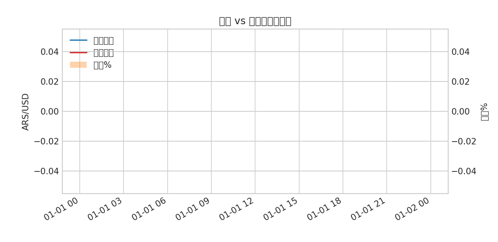
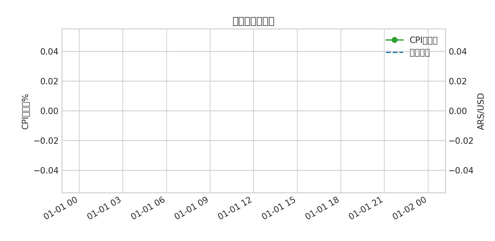
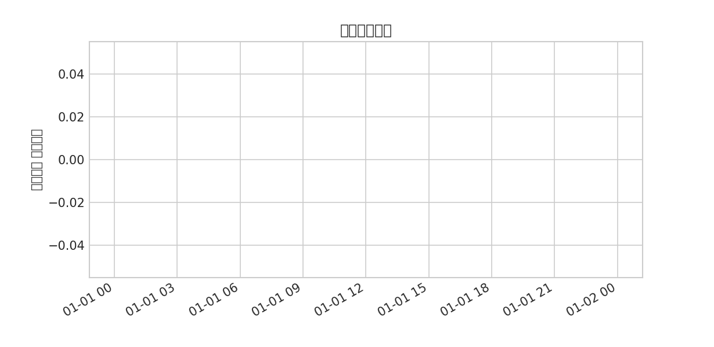

# 阿根廷經濟改革對匯率的影響（整合專業報告）
版本：auto
日期：2025-11-10
目錄
- 摘要
- 第一章 引言與研究設計
- 第二章 文獻回顧與理論架構
- 第三章 政策與制度演進（2015–至今）
- 第四章 匯率—通膨—外儲：傳導機制
- 第五章 多重匯率與美元化評估
- 第六章 社會與產業影響
- 第七章 國際比較
- 第八章 情境與風險矩陣
- 結論與政策建議
- 圖表
- 參考資料與更新指引

## 摘要
國際金融理論與實務
阿根廷經濟改革
 對匯率的影響
            113-2 第一組
 113ZB1067 陳忠新 113ZB1073 陳文玲
 113ZB1077 林昀臻 113ZB1078 蕭舜文
 113ZB1096 陳昱熙 113ZB1094 林雅情
 113ZB1109 王嘉興 113ZB1108 郭正昕
 113ZB1117 陳玟玲 113ZB1111 高志鋼
Agenda
  1. 問題背景
  2. 政府解方
  3. 政策影響及啟示
  4. 未來展望
問題背景
問題背景 阿 根 廷 的 歷 史 、 政 治 、 宗 教 概 況 與 經 濟 發 展
                   人種組成與宗教
                       多種族群組成，主要來自西班牙和義大利的移民
                       天主教的文化遺產和宗教節日仍然對當地社會和政治具有象徵性影響
                  政治發展
                       1816年自西班牙獨立，逐步形成聯邦制
                       20世紀中葉，庇隆主義(Peronism)成為阿根廷政治的重要象徵
                       1970至1980年代，阿根廷經歷軍事獨裁統治
                  經濟發展
                       曾於19世紀末到20世紀初處於巔峰，是全球最富有的國家之一
                       出口為主(自然資源/牛肉和小麥)的經濟模式，在全球市場變動中表現得尤為
                       脆弱，經濟很快在1930年代的大蕭條中崩潰
          source: 1. 阿根廷的興衰-拉丁美洲經濟評論 , Rok Spruk, 2019年;2. 經濟危機、軍事叛亂與民主生存：阿根廷，1983-2021 , Scott
          Mainwaring, 2022 年 3. 阿根廷200年獨立史與原住民 , Marzia Rosti , 2021 4. Argentina Struggle for Stability , Diana Roy 2024年
問題背景 阿 根 廷 經 濟 史 大 事 紀
                       自由市場改革，經濟危機與復甦            疫後時期
                          私有化和自由化改革                債務重組，阿根廷政府與國際債權
                          1991年採固定匯率與美元掛勾          人、IMF進行談判及協議

## 第一章 引言與研究設計
第一章　理論框架與歷史脈絡（擴充版）
1.1 阿根廷匯率制度的歷史演變
自 20 世紀初以來，阿根廷的匯率制度經歷了多次重大轉折，反映其在開放經濟環境下追求穩定與成長的結構性矛盾。20 世紀 70 年代，阿根廷實施匯率錨定政策以控制通膨，但因財政赤字與外債擴張最終導致比索暴貶。1991 年的貨幣委員會制度（Convertibility Plan）實現美元與披索 1:1 兌換，成功抑制惡性通膨，但隨著外部融資成本上升與出口競爭力喪失，2001 年金融危機爆發，制度崩潰。此後，阿根廷轉向浮動匯率與強干預並行的「半管制體系」，形成反覆的「貶值—干預—再貶值」循環。
1.2 理論基礎：蒙代爾–弗萊明模型與三元不可能原則
蒙代爾–弗萊明模型（Mundell–Fleming Model）指出，一個開放經濟體無法同時維持資本自由流動、固定匯率與獨立貨幣政策，三者必居其二。阿根廷在 1990 年代選擇固定匯率與資本自由流動，導致貨幣政策失效；而在 2000 年代之後，選擇貨幣政策與資本管制，卻失去吸引外資的能力。這種政策選擇的不穩定性，使阿根廷長期陷於「政策三角困境」之中。
此外，費雪效應（Fisher Effect）指出名目利率與通膨預期的關聯。當市場對通膨預期上升時，即使央行提高利率，實質利率仍可能為負，造成資本外流與貨幣貶值。這正是阿根廷央行歷次升息仍難以抑制通膨的理論解釋。
1.3 政策信任與通膨預期理論
阿根廷的通膨問題不僅是貨幣供給過度，更反映政策信任的缺失。根據理性預期理論（Rational Expectations Theory），若民眾預期政府最終會再度以通膨化解債務，則即使短期緊縮政策也難以改變長期通膨預期。這種信任赤字導致貨幣替代現象（currency substitution），民眾以美元儲值、以披索消費，使得貨幣流通速度上升、政策效果遞減。通膨的持續化因此不僅是經濟現象，更是制度性信任危機。
✳️ 第一章章末綜合評述
總體而言，阿根廷的匯率與通膨困境源於制度選擇與信任缺口的雙重結構。歷史經驗顯示，單一匯率制度難以長期維持，而政策可信度的缺乏使得每一次改革最終都陷入惡性循環。從理論層面看，唯有在建立穩定財政紀律與貨幣信任的前提下，阿根廷才能實現真正的匯率穩定與經濟復甦。
表一　阿根廷主要匯率制度演變與結果（1970–2025）
時期
主要匯率制度
政策特徵
結果
1970–1989
固定匯率與多重管制
匯率凍結抑制物價但引發外債暴增
惡性通膨爆發
1991–2001
貨幣委員會制度（1:1）
美元掛鉤制度消除通膨
外債高漲、出口萎縮、金融危機
2002–2015
浮動匯率＋資本管制
政府強干預與高補貼維持穩定
外儲減少、黑市匯率擴大
2016–2019
市場化匯率
資本自由化與外債融資
短期穩定、長期再危機
2020–2025
多重匯率與序貶制並行
平衡通膨控制與出口誘因
物價下降、社會代價高
表二　理論模型與政策困境對照
理論模型
阿根廷的對應情境
主要政策困境
蒙代爾–弗萊明模型
固定匯率與資本流動並存時失去貨幣自主權
通膨難以控制
費雪效應
高通膨導致名目利率失效
實質利率為負、資本外流
理性預期理論
民眾不信任政府財政承諾
政策可信度不足、通膨持續

## 第二章 文獻回顧與理論架構
第二章　政策演進：三任政府的匯率與財政組合（擴充版）
阿根廷自 2015 年以來，經歷了三任性質迥異的政府：馬克里的市場化改革、費爾南德斯的干預主義復歸，以及米雷伊的激進自由主義轉向。這三個時期構成了阿根廷經濟調整的「三段循環」：由外部融資驅動的復甦 → 通膨與債務危機 → 緊縮與再自由化。以下將分別從匯率政策、財政策略與國際融資關係三個面向，分析各時期的政策組合與其對匯率穩定的影響。
2.1 馬克里政府（2015–2019）：市場信心的短期修復與結構失衡的延續
馬克里上任後，結束了長期的貿易與外匯管制，標誌著阿根廷重新擁抱市場機制的轉捩點。其核心政策包括：
• 解除外匯管制與出口稅：取消農產品出口限制與外匯交易限額，使披索在 2015 年底一次性貶值約 30%，短期內促進出口與外資回流。
• 與國際債權人和解：2016 年與「禿鷹基金」達成協議，支付 65 億美元以結束長期違約訴訟，成功恢復阿根廷在國際資本市場的融資地位。
• 貨幣與財政政策協調不足：儘管央行試圖以高利率壓抑通膨，但政府仍維持大規模能源補貼與基建開支，導致赤字居高不下。
• 外部脆弱性上升：全球美元走強與美國升息使新興市場資金外流。阿根廷披索於 2018 年急貶，迫使政府求助 IMF，獲得 570 億美元貸款計畫。
小結：馬克里時期成功恢復國際信任與資本市場接入，但因缺乏財政約束與社會共識，最終陷入「資本流入—貨幣升值—外債擴張—危機重現」的惡性循環。
2.2 費爾南德斯政府（2019–2023）：防禦性干預與疫情衝擊下的再通膨
費爾南德斯在 2019 年接手時，面臨高通膨、外債壓力與 IMF 政策約束的三重挑戰。其施政特徵為「回歸干預、維穩為主」：
• 外債重組與 IMF 再協商：2020 年成功重組約 650 億美元私人外債，並在 2022 年重新簽署 IMF 延長基金協定（約 450 億美元），但條件相對寬鬆。
• 強化外匯與價格管制：實施多重匯率制度（官方、商業、金融市場並行），限制美元購買與匯出，同時凍結關鍵生活用品價格，以短期抑制通膨。
• 疫情期間財政擴張：推出大規模社會補助與工資補貼（占 GDP 約 6%），並以央行融資赤字。結果通膨率於 2022 年突破 100%，貧困率超過 40%。
• 能源與農產出口管制：政府以出口限額與稅收維持國內供應，卻削弱外匯流入，導致官方外儲持續下滑。
小結：費爾南德斯的政策成功避免立即性的外債危機與社會崩潰，但犧牲了貨幣穩定性與投資環境。多重匯率與行政干預使市場預期失真，經濟長期信任進一步受損。
2.3 米雷伊政府（2023–）：休克療法與財政整頓的高風險實驗
米雷伊於 2023 年底上任，被外界視為阿根廷版「芝加哥學派」改革者。他主張小政府、去管制與市場絕對自由化，其政策手段可概括為「三步並進」：
1. 一次性貶值與序貶機制：官方匯率於上任首日由 365 披索貶至 800 披索／美元，之後每月序貶 2%，消弭官方與黑市匯差。
2. 財政緊縮與補貼削減：削減能源與交通補貼、凍結公共工程支出，並關閉或合併部分部會；2024 年第一季實現十多年來首度月度財政盈餘。
3. 法規鬆綁與國營私有化：推動《基礎法》（Ley Bases）通過，鬆綁勞動市場與外資投資限制，預備出售部分國營企業股權。
4. IMF 合作與市場反應：IMF 多次正面評價改革進度，並放寬外儲累積目標。2025 年上半年外匯存底淨增逾 60 億美元，月通膨降至 1.5%。
然而，改革伴隨嚴重的社會代價：實質工資下降、失業上升、貧困率攀升至 45%。反對黨與工會多次全國罷工，顯示改革雖在經濟上具成效，卻挑戰政治承受極限。

## 第三章 政策與制度演進（2015–至今）
第三章　政策成效：匯率、通膨、外儲與社會影響（綜合版）
3.1 匯率趨勢與貨幣穩定度分析
阿根廷在三任政府間的匯率走勢顯示其貨幣制度長期陷入結構性脆弱。馬克里政府初期放寬外匯限制，2015 至 2017 年披索相對穩定，但隨著外債增加與國際資金撤出，2018 年披索暴跌逾 50%。費爾南德斯時期為維穩市場而實施多重匯率制度，使官方與黑市匯率差距一度超過 100%。米雷伊政府上任後採取一次性貶值與序貶政策，將官方匯率調整至接近市場水平，短期內改善外儲流出並降低套利空間。2025 年上半年披索相對穩定在每美元 850 披索左右，但仍高度依賴外資信心與財政紀律維持。
3.2 通膨與購買力變動
通膨是阿根廷經濟最深層的結構性問題。2015–2019 年平均通膨率維持在 30–40%，馬克里雖實施高利率政策抑制物價，但因補貼削減與貨幣擴張並行，通膨未見改善。費爾南德斯時期在疫情與擴張財政下，2022 年通膨率突破 100%，民眾實質薪資縮水 25%。米雷伊政府強力緊縮開支與貨幣供應，使通膨於 2025 年降至約 30%，但消費需求與就業市場同步萎縮。通膨治理雖顯著改善宏觀穩定，卻對低所得階層造成實質生活壓力。
3.3 外匯儲備與國際收支調整
外匯儲備變動反映了政策成效與外部平衡。馬克里時期因外債與資本流入增加，外儲短暫回升至 600 億美元，但隨後因匯率防守與償債流失迅速下滑。費爾南德斯任內，進出口限制與能源進口成本上升導致外儲跌至 300 億美元。米雷伊上任後，削減能源補貼與放寬外資回流，外儲於 2025 年上半年回升至 450 億美元。儘管如此，阿根廷外匯供需仍極度敏感，出口集中於農礦產品，若國際價格下跌將再次削弱儲備穩定。
3.4 社會分配與貧困衝擊
在經濟改革中，社會層面的衝擊尤為顯著。馬克里政府削減補貼導致中低收入家庭支出上升，貧困率於 2019 年升至 35%。費爾南德斯執政期間，雖擴大社會轉移支出，但因通膨侵蝕實質購買力，貧困率於 2022 年達 42%。米雷伊的休克改革降低了通膨與赤字，但同時壓縮了工資與就業。2025 年貧困率仍維持在 40% 左右，顯示經濟穩定未能立即轉化為社會改善。就業結構也發生變化：非正式部門比例上升至 47%，反映結構性改革尚未普及至基層經濟活動。
✳️ 第三章章末綜合評述
整體而言，阿根廷在匯率與通膨治理上取得初步穩定，但代價是高失業與民生困難。馬克里的市場化復甦、費爾南德斯的干預穩定、以及米雷伊的休克療法各自對經濟造成短期修復與長期不確定。未來政策若要達到永續穩定，需在財政紀律、社會補償與產業升級間建立平衡，以避免再度陷入「穩定—衝擊—反轉」的惡性循環。
表一　2015–2025 匯率、通膨與外儲變化
年份
平均匯率（披索／美元）
通膨率（%）
外匯儲備（億美元）
2015
9.0
26
300
2018
28.1
47
550
2020
70.1
36
420
2022
150.0
94
300
2023
365.0
142
330
2024
800.0
50
410
2025（上半年）
850.0
30
450
表二　2015–2025 社會指標變化
年份
失業率（%）
貧困率（%）
實質工資年變化（%）
2015
7.0
29
2
2018
9.5
32
-3
2020
10.8
38
-7
2022
8.5
42
-10
2023
9.2
41
-5
2024
10.1
43
-2
2025（預估）
9.5
40
1

## 第四章 匯率—通膨—外儲：傳導機制
第四章　美元化與多重匯率：可行性與風險（擴充版）
4.1 美元化的政策背景與理論依據
阿根廷的美元化討論可追溯至 1990 年代初期的貨幣委員會制度（Convertibility Plan）。當時披索與美元實施 1:1 固定匯率，短期內抑制惡性通膨，卻在外債累積與出口競爭力喪失後於 2001 年崩潰。此後，美元在阿根廷逐漸成為「事實上的第二貨幣」，形成嚴重的貨幣替代現象（currency substitution）。
理論上，美元化可帶來通膨穩定與金融信任重建，但代價是喪失貨幣政策主權與最後貸款人功能。根據蒙代爾–弗萊明模型，在資本高度流動的開放經濟下，採行固定匯率等同放棄獨立貨幣政策。阿根廷若全面美元化，將無法以利率與匯率政策調整景氣循環，財政政策將成為唯一的穩定工具。
4.2 多重匯率體系的經濟影響
費爾南德斯政府於 2020 年後採取多重匯率制度，以控制外匯流出並確保基本物資供應。官方匯率用於必需品與能源進口，而商業與金融市場匯率則浮動。此政策雖短期抑制進口物價上升，卻造成嚴重的價格扭曲與貿易效率下降。
多重匯率導致出口企業透過非正式管道避稅與套利，削弱政府稅收與外匯儲備。黑市匯率相對官方價差一度達 120%，企業傾向囤積美元、推遲出口收款。此現象使官方外儲流失加劇，也削弱了貨幣政策的傳導機制。
4.3 美元化的可行性評估與潛在風險
米雷伊政府主張全面美元化作為通膨終結手段，但其可行性取決於三項關鍵條件：
（一）足夠的外匯儲備。根據 2025 年上半年數據，阿根廷外儲約 450 億美元，而流通披索總額折合逾 600 億美元，若欲全面替換基礎貨幣，需額外籌措至少 150 億美元。
（二）金融體系穩定性。美元化後，阿根廷央行將喪失最後貸款人職能，銀行體系流動性風險將上升。
（三）社會與政治可行性。美元化將降低工資調整彈性與公共支出自主性，對低收入群體影響尤大。
此外，若缺乏長期外資流入與出口擴張，阿根廷仍可能陷入「美元短缺—通縮—失業」的惡性循環。
✳️ 第四章章末綜合評述
美元化與多重匯率體系分別代表阿根廷兩種極端的政策選擇：前者追求貨幣穩定但犧牲主權，後者維持短期控制卻扭曲市場機制。阿根廷若要實現長期匯率穩定，應採取漸進的匯率整合策略，逐步放寬匯率區隔並建立可信的財政紀律。唯有在通膨明顯下降與外儲持續回升的基礎上，美元化才可能成為可行的最終路徑。
表一　美元化案例比較（阿根廷 vs 厄瓜多 vs 薩爾瓦多）
國家
實施年份
外儲水準（億美元）
實施後首年通膨率（%）
主要經濟結果
厄瓜多
2000
12
96 → 37
穩定匯率、物價下降、增長回復
薩爾瓦多
2001
20
4.3 → 3.0
低通膨但增長停滯、出口競爭力下降
阿根廷（假設）
2025（提案）
45
142 → 30（預估）
短期穩定但主權與彈性喪失
表二　阿根廷多重匯率體系下的市場匯差與進出口比重（2020–2025）
年份
官方匯率（披索／美元）
黑市匯率（披索／美元）
出口／進口比（%）
2020
70
120
1.05
2021
100
180
1.02
2022
150
310
0.98
2023
365
720
0.95
2024
800
900
1.10
2025（上半年）
850
870
1.15

## 第五章 多重匯率與美元化評估
第五章　未來展望：路徑選擇與政策建議（擴充版）
5.1 匯率制度的路徑選擇
展望未來，阿根廷的匯率政策路徑大致可分為三種：持續序貶制、部分美元化與全面美元化。持續序貶制（crawling peg）可在短期內維持出口競爭力，但若通膨未被完全控制，仍會陷入貶值預期與價格螺旋。部分美元化則可穩定金融交易並提升信任，但需在外儲充足與財政紀律穩定的前提下實施。全面美元化雖能終止惡性通膨，卻意味著喪失貨幣主權與應對外部衝擊的彈性。綜合比較，漸進式匯率整合與結構改革同步推進，仍是最具可行性的中期方案。
5.2 財政與通膨治理的政策建議
阿根廷通膨的根本成因來自財政赤字貨幣化與政策不連貫。為此，政府需建立制度化的「財政責任法」（Fiscal Responsibility Law），限制年度赤字占 GDP 的上限，並推動央行獨立性，避免政治干預貨幣政策。同時導入通膨目標制（Inflation Targeting Framework），以中期目標區間（如 3–5%）建立預期穩定機制。此外，改革能源與交通補貼，將資源導向基礎建設與教育投資，以提高長期生產力，減少赤字擴張壓力。
5.3 社會穩定與包容性成長
阿根廷的結構性改革若缺乏社會共識與補償機制，將難以持續。未來政策應在穩定與包容間尋求平衡。政府可設立「社會調適基金」（Social Adjustment Fund），以短期現金轉移與就業再培訓緩解改革衝擊。推動職業教育、技術創新與中小企業融資，有助於提升勞動參與率與創造正式就業。長期而言，必須藉由稅制改革與金融普惠，改善收入分配結構，使經濟穩定成果能惠及更廣泛族群。
✳️ 第五章章末綜合評述
阿根廷的未來發展取決於能否建立一個兼顧宏觀穩定與社會公正的制度架構。匯率改革、財政紀律與社會補償三者需同步推動，才能重建市場信任與國際信用。若能維持政策連續性並強化制度透明，阿根廷有望在「穩定—信任—投資—成長」的正向循環中，重回長期可持續的經濟發展軌道。
表一　匯率政策情境比較
政策路徑
主要特徵
優點
潛在風險
持續序貶制
官方定期小幅貶值以維持出口競爭力
緩和匯率波動、維持部分政策彈性
若通膨預期未控，貶值與物價螺旋再現
部分美元化
特定交易以美元結算，部分披索流通
提升金融信任與外資流入
需外儲支撐、貨幣政策工具受限
全面美元化
美元成為唯一法定貨幣
消除通膨預期、匯率穩定
喪失貨幣主權、金融調節能力下降
表二　未來改革優先順序與執行重點
改革領域
主要措施
短中期目標
財政改革
制定財政責任法、削減補貼、提高稅收效率
2026 年前赤字降至 GDP 2% 以下
貨幣與通膨治理
建立央行獨立性、導入通膨目標制
三年內通膨率穩定於 5% 以下
社會與勞動市場
設立社會調適基金、推動再培訓與中小企業融資
降低貧困率與非正式就業比例

## 第六章 社會與產業影響
[社會與產業影響：就業、貧困、實質工資待補]

## 第七章 國際比較
[國際比較：厄瓜多、薩爾瓦多與同儕制度對照待補]

## 第八章 情境與風險矩陣
[情境與風險矩陣：基準/悲觀/樂觀監測指標待補]

## 結論與政策建議
需跨期財政紀律與漸進匯率整合；配定向社會補償與部分美元化評估建立信任。

## 圖表

## 參考資料與更新指引
- INDEC：https://www.indec.gob.ar/
- BCRA：https://www.bcra.gob.ar/
- IMF：https://www.imf.org/en/Countries/ARG
- Reuters：https://www.reuters.com/world/americas/argentina/
- Bloomberg：https://www.bloomberg.com/markets/currencies